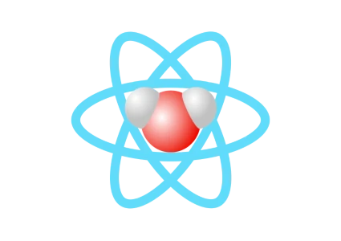

<h1>components-extra</h1>

<h3>React UI molecule components based on styled-components & material-ui.</h3>

Thank you for using components-extra <3. Here you will learn how to set up in 2 minutes the lib inside your app.

## Get started

### Prerequisites

Before anything, please make you to have the three following packages installed:

- [react >= 16.8.0](https://www.npmjs.com/package/react)
- [react-dom >= 16.8.0](https://www.npmjs.com/package/react-dom)
- [styled-components](https://www.npmjs.com/package/styled-components)